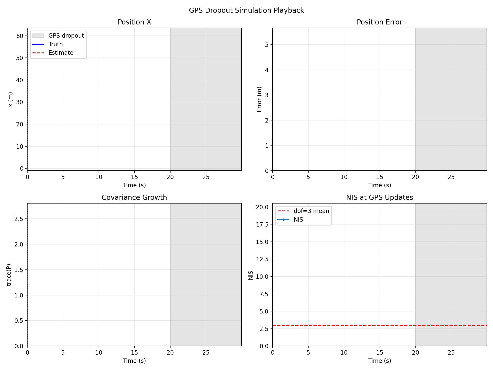
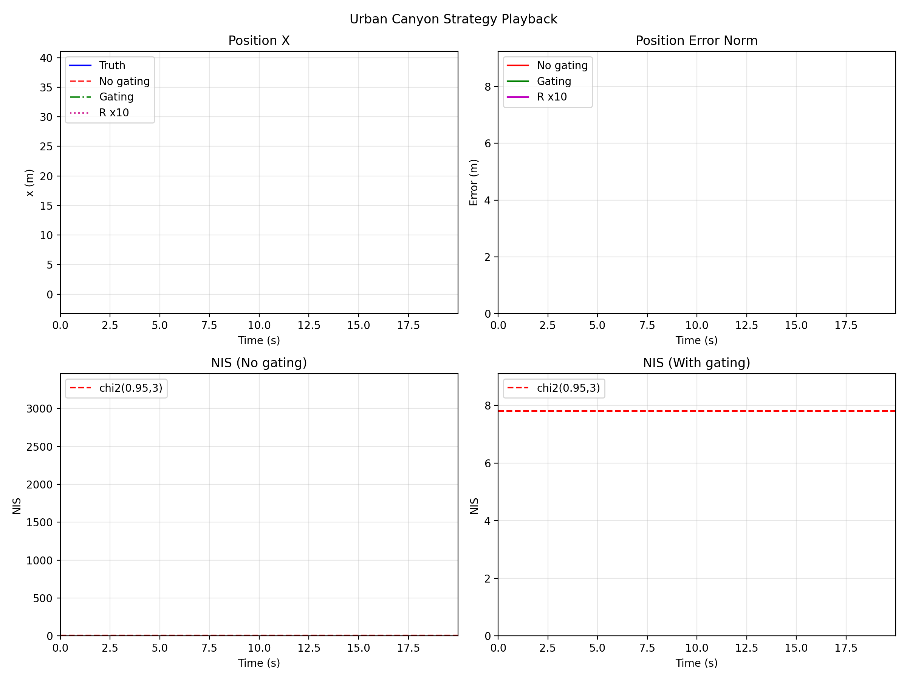
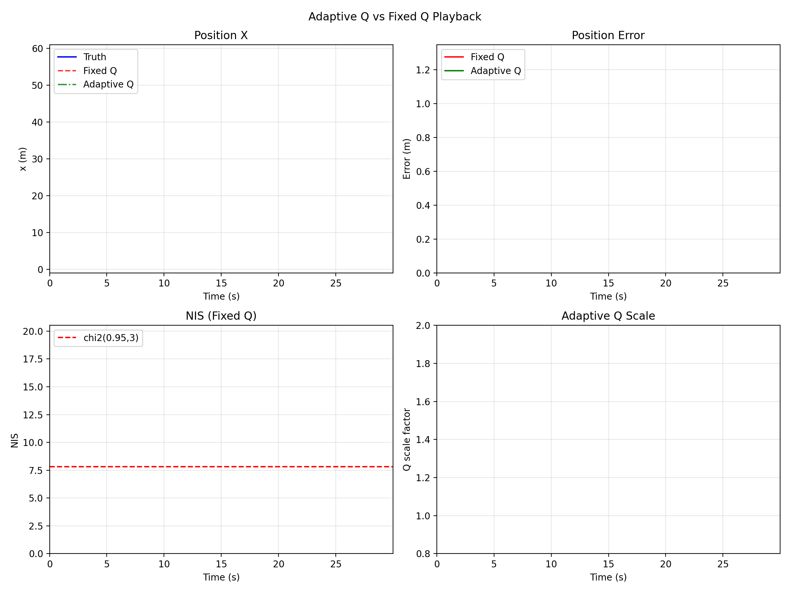

# INS-GPS Fusion Lab

**INS-GPS Simulation & Fusion Suite** — an open-source, reusable sensor fusion research and validation toolkit.

## Key Results

<p align="center">
	
	
	
</p>

| Scenario | What to look for |
|---|---|
| **GPS dropout** 📉 | During outage, uncertainty and position error grow; after recovery, updates pull the estimate back. |
| **Urban canyon** 🏙️ | Innovation gating suppresses outlier impact compared with ungated updates. |
| **Adaptive Q** ⚙️ | Dynamic process-noise scaling improves robustness under Q mismatch. |

## Positioning

- **Target users**: Researchers, engineers, students — for Kalman filter learning, algorithm validation, prototyping, and teaching
- **Coverage**: IMU and GPS modeling, state space design, Q/R tuning, NIS test, innovation gating, GPS dropout, urban canyon simulation, adaptive Q
- **Engineering value**: Reproducible experiments, configurable simulation, extensible filter interface, ready for algorithm comparison and tuning

## Installation

```bash
# Clone the repository
git clone https://github.com/your-username/ins-gps-fusion-lab.git
cd ins-gps-fusion-lab

# Install in development mode (recommended)
pip install -e ".[dev]"
```

## Usage

### Run examples

```bash
# Basic INS-GPS fusion (trajectory + IMU + GPS + Kalman filter)
python -m experiments.run_basic_fusion

# GPS dropout (20s loss at 20-40s)
python -m experiments.gps_dropout

# Q mismatch (filter inconsistency)
python -m experiments.test_q_mismatch

# Urban canyon (outliers, gating comparison)
python -m experiments.urban_canyon

# Adaptive Q vs fixed Q
python -m experiments.adaptive_q

# Run tests
pytest tests/

# Optional: run tests and generate local reports under results/test_reports/
python scripts/run_tests.py
```

### Animated simulation playback

```python
from experiments.gps_dropout import run_animation as run_dropout_animation
from experiments.urban_canyon import run_animation as run_urban_animation
from experiments.adaptive_q import run_animation as run_adaptive_q_animation

# GPS dropout playback (save GIF + show window)
run_dropout_animation(
	duration=30.0,
	frame_stride=20,
	fps=20,
	output_path="media/readme/gps_dropout.gif",
	show=True,
)

# Urban canyon strategy playback (save GIF, no interactive window)
run_urban_animation(
	duration=20.0,
	frame_stride=10,
	fps=20,
	output_path="media/readme/urban_canyon.gif",
	show=False,
)

# Adaptive Q playback (save GIF)
run_adaptive_q_animation(
	duration=30.0,
	frame_stride=10,
	fps=20,
	output_path="media/readme/adaptive_q.gif",
	show=False,
)
```

### Use as a library

```python
from ins_gps_fusion_lab.simulation.imu_model import IMUModel
from ins_gps_fusion_lab.simulation.gps_model import GPSModel

# Create IMU model with configurable noise parameters
imu = IMUModel(sigma_acc=0.1, sigma_gyro=0.01, seed=42)
acc_meas, gyro_meas = imu.generate_measurements(truth_acc, truth_gyro, dt=0.01)

# Create GPS model with optional outlier/dropout
gps = GPSModel(sigma_pos=1.0, outlier_prob=0.01)
position_meas, valid = gps.generate_measurement(true_position)
```

## Project Structure

```
ins-gps-fusion-lab/
├── docs/             # Theory and design notes
├── src/
│   └── ins_gps_fusion_lab/
│       ├── simulation/       # IMU, GPS, trajectory models
│       ├── filters/          # Kalman filter, EKF
│       └── visualization/    # Plotting utilities
├── experiments/      # Runnable experiments
└── tests/            # Unit tests
```

## License

MIT License — see [LICENSE](LICENSE) for details.
